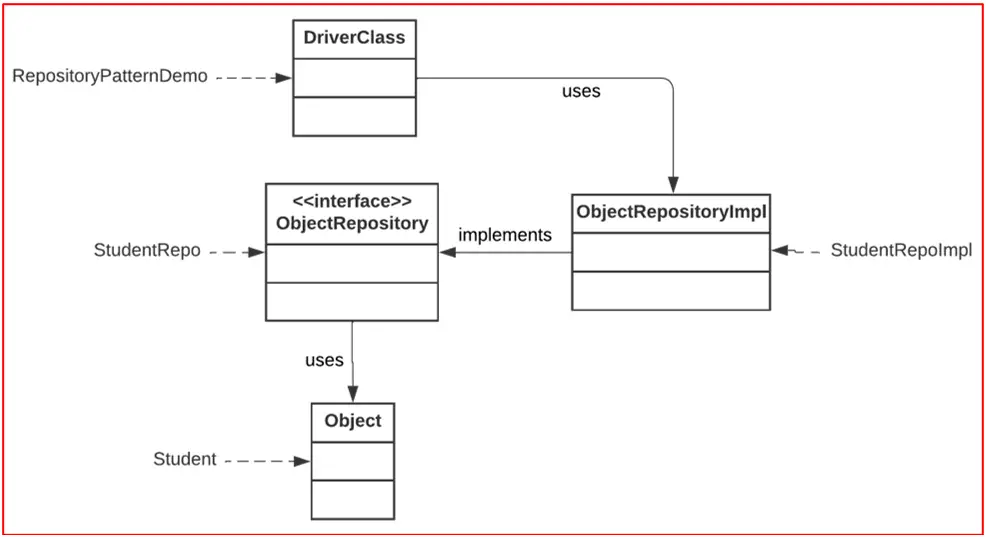

**Использование паттерн проектированния Repository**

Источник: https://dotnettutorials.net/lesson/repository-design-pattern-in-java/

Данный проект демонстрирует работу простого консольного приложения, которое реализует простой вариант паттерна Repository
(«Репозиторий») на примере управления информацией о студентах. Целью этого примера является наглядное отображение
основных операций над данными: добавить, обновить, удалить и просмотреть информацию о студенте.

Порядок исследования:
1. Создание класса сущности [class Student]
2. Создание интерфейса [interface StudentRepository], в котором определены методы для реализации классом репозитория
[class StudentRepositoryImpl]
3. Создание класса [StudentRepositoryImpl] для предоставления конкретной реализации методов в интерфейсе
[interface StudentRepository]. Нужен для обеспечения функциональности при работе с хранилищем [переменная "students" в 
StudentRepositoryImpl, которая является хеш-картой (HashMap)].
4. Создание класса [class RepositoryPatternDemo], который отвечает за демонстрацию работы

UML диаграмма:

Классы могут быть описаны следующим образом:

**Object:** представляет сущность, которую необходимо сохранить в репозитории.
**ObjectRepository и ObjectRepositoryImpl:** это интерфейс репозитория и его реализация.
**DriverClass:** этот класс содержит функцию main() и отвечает за моделирование программы.